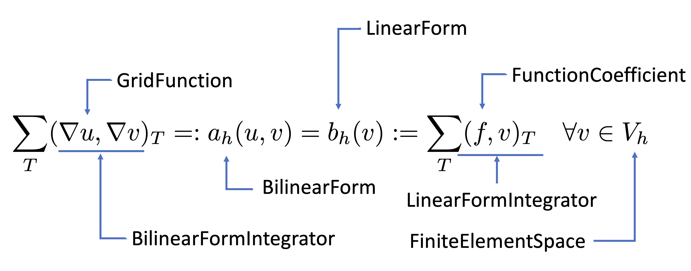

<style>
  :root {
  }
  h1 {
    font-size: 26pt;
  }
  h2 {
    font-size: 22pt;
  }
  li {
    font-size: 18pt;
  }
  p {
    font-size: 18pt;
  }
  img[alt~="center"] {
    display: block;
    margin: 0 auto;
  }
  pre {
   background-color: #333333;
  }
</style>

<!-- _paginate: false -->


# **MFEM Tutorial**

#### Dohyun Kim

##### Appl. Math., Brown Univ.

_APMA 2560_
_April 10, 2023_

---

<!-- _paginate: false -->

# Table of Contents

* Weak Formulation
* Finite Element Formulation
* Basic Structures for Linear Problem: $a_h(u,v) = b_h(v)$
* Technical Details
  - Mesh, Basis, Assembly, Quadrature rules,

---

# Weak Formulation

Consider the Poisson equation with homogeneous Dirichlet BC

$$
\begin{align*}
-Δ u&=f&&\text{in }\Omega,\\
u&=0&&\text{on }\partial\Omega.
\end{align*}
$$

The corresponding weak formulation is: Find $u∈H^1_0(\Omega)$ such that

$$
\begin{equation}
a(u,v):= (∇ u, ∇ v) = (f,v) =: b(v)\quad∀v∈H^1_0(\Omega).
\end{equation}
$$

---

# Discrete Space

Let $\mathcal{T}_h$ be a given mesh, and
$$V_h=\{v∈C^0(\Omega):v|_T∈ \mathbb{P}_p(T)\;∀ T∈ \mathcal{T}_h\}.$$

We impose the boundary condition by setting

$$
V_h^g=\{v∈ V_h:v|_e=\Pi_h^eg\;∀e\in\mathcal{E}_h\}
$$

where $\Pi_h^e$ is a projection onto $\mathbb{P}_p(e)$ and globally continuous if necessary.


---

# Discrete Formulation

The corresponding discrete problem is: Find $u_h∈ V_h^g$ such that

$$
a_h(u_h,v):=\sum_{T\in\mathcal{T}_h}(∇ u_h,∇ v)_T=\sum_{T\in\mathcal{T}_h}(f,v)_T=:b_h(v)\quad ∀ v∈ V_h^0.
$$

Here, $a_h(\cdot,\cdot)$ is a bilinear form, and $b_h(\cdot)$ is a linear form so that

* $a_h(u+w,cv)=ca_h(u,v)+ca_h(w,v)$ for all $u,w,v∈ V_h$ and $c\in\mathbb{R}$,
* $a_h(cu,v+w)=ca_h(u,v)+ca_h(u,w)$ for all $u,v,w∈ V_h$ and $c\in\mathbb{R}$,
* $b_h(cv+w)= cb_h(v)+b_h(w)$ for all $v,w∈ V_h$ and $c\in\mathbb{R}$.

* Note that $a_h(\cdot,\cdot)=a(\cdot,\cdot),\;b_h(\cdot)=b(\cdot)$ for the most of conforming FEMs.
* But, $a_h(\cdot,\cdot)≠a(\cdot,\cdot)$ when you consider, e.g., Discontinuous Galerkin method.

---

# Basis of $V_h$


* Let $\{\phi_i\}_{i=1}^N$ be a basis of $V_h$. Then for given $v∈ V_h$, there exists $(c_1,\cdots,c_N)$ such that
   $$
   v=\sum_{j=1}^Nc_j\phi_i
   $$

* Then we can rewrite the equation as: Find $u_h=\sum_{j=1}^Nc_j\phi_j$ or find $\{c_j\}_{j=1}^N$ such that
   $$
   a_h(\sum_{j=1}^Nc_j\phi_j,v)=\sum_{j=1}^N c_j a_h(\phi_j, v)=b_h(v)\quad∀ v∈ V_h.
   $$

* Since $V_h$ is finite dimensional and $a_h(\cdot,\cdot)$ is a bilinear form, it is enough to test the equation against basis functions.
   $$
   \sum_{j=1}^N c_j a_h(\phi_j, \phi_i)=b_h(\phi_i)\quad∀ i∈ 1,\cdots,N.
   $$

---

# Linear System

* Now we obtained a set of equations
  
   $$
   \sum_{j=1}^N c_j a_h(\phi_j, \phi_i)=b_h(\phi_i)\quad∀ i∈ 1,\cdots,N.
   $$

* This can be rewritten as
   $$
   Au=b
   $$
   where 
   $$
   A_{ij} = a_h(\phi_j, \phi_i), u_i = c_i, b_i = b_h(\phi_i)
   $$


---

# Summary

* For given finite element space $V_h$ with $dim(V_h)=N$, we find solution $u_h ∈ V_h$ by

   $$
   a_h(u_h,v):=\sum_{T∈\mathcal{T}_h}(∇ u_h, v)_T=\sum_{T\in\mathcal{T}_h}(f,v)=:b_h(v)\quad∀ v∈ V_h
   $$

* Using the basis representation, we obtain a corresponding linear system

   $$
   Au = b
   $$
   where
   $$
   A_{ij} = a_h(\phi_j,\phi_i),\ u_i = c_i,\ b_i = b_h(\phi_i)
   $$

---

<style>
  :root {
  }
  h1 {
    font-size: 32pt;
  }
  h2 {
    font-size: 24pt;
  }
  li {
    font-size: 18pt;
  }
  p {
    font-size: 18pt;
  }
  img[alt~="center"] {
    display: block;
    margin: 0 auto;
  }
</style>

<!-- _paginate: false -->


# **Finite Element Space**

   ## FiniteElementCollection

   ## Mesh

   ## FiniteElementSpace

   ## GridFunction / Coefficient

---

# FiniteElementCollection

* We use `FiniteElementCollection` to represent a local finite element space.

* Examples are: ($P_k$: Complete polynomial, $Q_k$: Tensor product polynomial)
  * `H1_FECollection` - Continuous $P_k/Q_k$ space
  * `DG_FECollection/L2_FECollection` - Discontinuous $P_k/Q_k$ space
  * `RT_FECollection` - $H(div)$-conforming Raviart-Thomas space
  * `ND_FECollection` - $H(curl)$-conforming Nedelec space
  * see, [FiniteElementCollection](https://docs.mfem.org/html/classmfem_1_1FiniteElementCollection.html) for exhaustive list.

* Code Example:
   Discontinuous Bernstien finite element space
   ```cpp
   FiniteElementCollection *fec = new DG_FECollection(order, dim, BasisType::Positive);
   ```

---

# Mesh

* We use `Mesh` class to represent meshes.
* A `Mesh` object can be created either from a file
   ```cpp
   Mesh * mesh = new Mesh("path/to/meshfile.mesh");
   ```
* or
   ```cpp
   Mesh mesh = Mesh::MakeCartesian2D(nx, ny, Element::QUADRILATERAL); // Uniform 2D rectangular mesh
   ```
* You can also perform uniform refinements or save the mesh
   ```cpp
   Mesh mesh = Mesh::MakeCartesian2D(nx, ny, Element::TRIANGLE);
   mesh.UniformRefinement();
   mesh.Save("path/to/meshfile.mesh");
   ```
* It supports nonconforming and/or curved meshes.
* The mesh file can be created 1) manually, 2) Gmsh, and so on. See, this [guide](https://mfem.org/mesh-formats/).

---
# Mesh - continued I

   ```
   MFEM mesh v1.0

   # Space dimension: 2 or 3
   dimension
   2 # spatial dimension

   # Mesh elements, e.g. tetrahedrons (4)
   elements
   <number of elements>
   <element attribute> <geometry type> <vertex index 1> ... <vertex index m>
   \...

   # Mesh faces/edges on the boundary, e.g. triangles (2)
   boundary
   <number of boundary elements>
   <boundary element attribute> <geometry type> <vertex index 1> ... <vertex index m>
   \...

   # Vertex coordinates
   vertices
   <number of vertices>
   <vdim>
   <coordinate 1> ... <coordinate <vdim>
   \...
   ```

---

# Finite Element Space

* With `FiniteElementCollection` and `Mesh`, we can define a finite element space $V_h$.
* We use a `FiniteElementSpace` class to store the information
   ```cpp
   FiniteElementSpace fespace(mesh, fec);
   ```
* This object contains
  * Local finite element space type
  * Local finite element space order
  * Mapping between local/global degrees of freedom
  * ...

---

# GridFunction

* A discrete function $u_h∈ V_h$ can be created using
   ```cpp
   GridFunction u(&fespace);
   ```

* This is a `Vector` contains the coefficient `[u0, u1, ..., uN]`
* It provides
  * `GetValue`: Value at a point in an element
  * `GetValues`: Values at a point in an element
  * `GetVectorValues`: Get vector values if it is a vector FE

---

# FunctionCoefficient

* On the other hand, `FunctionCoefficient` represents a function $\mathbb{R}^n\rightarrow\mathbb{R}$.
   ```cpp
   // 2D coordinates x=(x,y) ↦ sin(x)*sin(y)
   FunctionCoefficient f([](const Vector& x){return sin(x[0])*sin(x[1])});
   ```
* For a vector-valued function, we use `VectorFunctionCoefficient`
   ```cpp
   // 2D coordinates x=(x,y) ↦ (sin(x), sin(y))
   VectorFunctionCoefficient f(2, [](const Vector &x, Vector y){y[0] = sin(x[0]); y[1] = sin(x[1])});
   ```
* When you want to compute its value at `x`, then use
   ```cpp
   Vector x(2);
   x = 0.5; // equivalent to x[0] = x[1] = 0.5;
   const double value = f.Eval(x); // if f:R^n → R
   Vector y(2);
   f.Eval(x, y); // if f:R^n → R^d
   ```

---

# FunctionCoefficient - Continued

* If you want to use a `GridFunction` as a function, you can do
   ```cpp
   GridFunction u(&fespace);
   <some implementations ...>
   // now you have a discrete solution !
   // You want to compute the value of u at (0.5, 0.5)
   // But you don't know which element contains (0.5,0.5)
   GridFunctionCoefficient u_cf(u) // u_cf is now act like a function
   Vector x(2); x = 0.5; // point to be evaluated
   const double value_at_center = u_cf.Eval(x);
   ```

* `ConstantCoefficient` is also useful
   ```cpp
   ConstantCoefficient one(1.0);
   ```

---
# Summary

```cpp
const int order = 2;
const int nx = ny = 2;

Mesh mesh = Mesh::MakeCartesian2D(nx, ny, Element::QUADRILATERAL);
const int dim  = mesh.Dimension(); // spatial dimension, 2
FiniteElementCollection *fec = new H1_FECollection(order, dim); // C0, Quadratic Polynomial
// You can also define a vector FE space
const int vdim = 2; // vector dimension
FiniteElementSpace fespace(&mesh, fec, vdim); // [C0-Q2 space]^2
GridFunction u(&fespace);
```


---

<style>
  :root {
  }
  h1 {
    font-size: 32pt;
  }
  h2 {
    font-size: 24pt;
  }
  li {
    font-size: 18pt;
  }
  p {
    font-size: 18pt;
  }
  img[alt~="center"] {
    display: block;
    margin: 0 auto;
  }
</style>

<!-- _paginate: false -->


# **(Bi)LinearForm**

   ## (Bi)LinearForm

   ## Element/FaceFormIntegrator

   ## NonlinearForm

---

# (Bi)linear Form

* Recall that we have a bilinear form $a_h(\cdot,\cdot)$.
* This operator is $a_h(\cdot,\cdot):V_h × V_h → \mathbb{R}$.
* We use `BilinearForm` to represent such operator
   ```cpp
   BilinearForm a_h(&fespace);
   ```
* If $a_h(\cdot,\cdot):V_h× W_h→ \mathbb{R}$, then
  ```cpp
  MixedBilinearForm a_h(&fespace1, &fespace2);
  ```
* For a linear form $b_h(\cdot):V_h→ \mathbb{R}$, we use
   ```cpp
   LinearForm b_h(&fespace);
   ```
---

# FormIntegrator

* Now you have a bilinear form $a_h(\cdot,\cdot)$, `BilinearForm a`
* But you did not specify its actual implementation
  $$
  a_h(u, v) = \sum_{T\in\mathcal{T}_h}(∇ u, ∇ v)_T
  $$
* The local bilinear form $(∇ u, ∇ v)_T$ is called `BilinearFormIntegrator`.
* This class should contains:
  * `AssembleElementMatrix`: if it is element integrator, $(\cdot,\cdot)_T$
  * `AssembleFaceMatrix`: if it is face integrator, $(\cdot,\cdot)_F$
  * ... see, `bilininteg.hpp`
* Examples are:
  * `MassIntegrator`: $(u, v)_T$
  * `DiffusionIntegrator`: $(∇ u, ∇ v)$
  * `MixedVectorDivergenceIntegrator`: $(∇ ⋅ u, v)$
  * `TransposeIntegrator`: convert $(f(u), g(v))$ to $(f(v), g(u))$

---
# FormIntegrator - continued

* You can add `BilinearFormIntegrator` to `BilinearForm`
   ```cpp
   BilinearForm a_h(&fespace);
   a_h.AddDomainIntegrator(new DiffusionIntegrator); // a_h = ∑_T(∇ u, ∇ v)
   a_h.AddDomainIntegrator(new MassIntegrator); // a_h = ∑_T [ (∇ u, ∇ v) + (u, v) ]
   a_h.AddInteriorFaceIntegrator(new SomeFaceIntegrator); // a_h = ... + ∑_{F_i}(⋅⋅⋅, ⋅⋅⋅)_F
   a_h.AddBoundaryIntegrator(new SomeFaceIntegrator); // a_h = ... + ∑_{F_b}(⋅⋅⋅, ⋅⋅⋅)_F
   ```
* For a `LinearForm`, you can use `LinearFormIntegrator`
* The most useful one is `DomainLFIntegrator` and `BoundaryLFIntegrator`
   ```cpp
   LinearForm b_h(&fespace);
   b_h.AddDomainIntegrator(new DomainLFIntegrator(f)); // b_h = ∑_T (f, v)
   b_h.AddBoundaryIntegrator(new BoundaryLFIntegrator(g)); // b_h = ... + (g_N, v)
   ```

---
# How to write FormIntegrator

```cpp
void MassIntegrator::AssembleElementMatrix
( const FiniteElement &el, ElementTransformation &Trans,
  DenseMatrix &elmat )
{
   // INPUT el: Local finite element: basis, dof, ...
   // INPUT Trans: Local mesh information. e.g., element location, Jacobian
   // OUTPUT elmat: resulting (ϕ_j, ϕ_i) where 0 ≤ i,j ≤ nd is local dof
   int nd = el.GetDof(); // the number of basis related to current element
   double w; // store weight

   Vector shape; // store basis function values at an integration point
   shape.SetSize(nd);
   elmat.SetSize(nd); // set output size

   // Determine integration rule in the location
   const IntegrationRule *ir = IntRule ? IntRule : &GetRule(el, el, Trans);

   elmat = 0.0; // initialize with 0
   for (int i = 0; i < ir->GetNPoints(); i++) // for each integration point
   {
      // Get current integration point (x_i, w_i)
      const IntegrationPoint &ip = ir->IntPoint(i);
      Trans.SetIntPoint (&ip);
      // 
      el.CalcPhysShape(Trans, shape);
      // update weight based on the element jacobian and integration weight
      w = Trans.Weight() * ip.weight;
      // elmat = elmat + w * (shape * shape^T)
      // Why? DIY
      AddMult_a_VVt(w, shape, elmat);
   }
}
```

---

<style>
  :root {
  }
  h1 {
    font-size: 32pt;
  }
  h2 {
    font-size: 24pt;
  }
  li {
    font-size: 18pt;
  }
  p {
    font-size: 18pt;
  }
  img[alt~="center"] {
    display: block;
    margin: 0 auto;
  }
</style>

<!-- _paginate: false -->


# **Ax=b and Solve**

   ## Essential Boundary

   ## FormLinearSystem

   ## Solvers

   ## RecoverFEMSolution

   ## Visualization

---

# $a_h(u,v)=b_h(v)$ and $Ax=b$

* Now we described our discrete problem $a_h(u, v) = b_h(v)$ in `MFEM`.
* In order to solve the problem,
   we need to convert it to a linear system, $Ax = b$.
* Also, recall that for $C^0$-finite element space,
   we impose Dirichlet boundary condition by
   $V_h^g=\{v∈ V_h:v|_{\Gamma_D}=g_D\}$
* Degrees of freedom related to $\Gamma_D$ are not unknowns.
* Therefore, we need to remove those degrees of freedom from the final linear system.

---

# Essential Boundary

* In a mesh file, you can specify boundary attribute
   ```
   # Mesh faces/edges on the boundary, e.g. triangles (2)
   boundary
   8 # 8 boundaries
   1 1 0 1 # Bottom (1), Segment, vertex 0 - vertex 1
   1 1 1 2 # Borrom (1), Segment, vertex 1 - vertex 2
   2 1 2 4 # Right (2), Segment, vertex 2 - vertex 4
   2 1 4 8 # Right (2), Segment, vertex 4 - vertex 8
   ...
   ```
* Suppose that you want to specify Dirichlet BC at bottom.
   ```cpp
   Mesh mesh(mesh_file);
   // create an integer array of size, the number of boundary attributes
   Array<int> ess_bdr(mesh.bdr_attributes.Max()); // in this case, 4
   ess_bdr = 0; // initialize with 0
   ess_bdr[0] = 1; // first boundary, bottom, is essential boundary
   // stores all degrees of freedom on the Dirichlet Boundary
   Array<int> ess_tdof_list;
   fespace.GetEssentialTrueDofs(ess_bdr, ess_tdof_list);
   // In this case, ess_tdof_list is of size
   // (order + 1) * 2 - 1
   ```
* This will be used when we remove dofs related to essential boundaries in the final linear system.

---

# FormLinearSystem

* To convert `BilinearForm a_h` and `LinarForm b_h` to $Ax=b$, we can
   ```cpp
   OperatorPtr A;
   Vector B, X;
   a_h.FormLinearSystem(ess_tdof_list, u, b_h, A, X, B);
   ```
* Here,
  * `u`: `GridFunction`, the solution with specified value on essential boundary
  * `A`: `OperatorPtr` or `SparseMatrix`, the resulting matrix $A$
  * `B`: `Vector`, the resulting load vector $b$
  * `X`: `Vector`, the vector containing coefficient, $x$.

---
# Solve Linear System

* To solve a system, there are many solvers in `MFEM`.
* Direct Sparse Solvers: `UMFPackSolver`: General matrix from `SuiteSparse`
* Iterative Solvers:
  * `CG`: Conjugate gradient method for SPD system
    ```cpp
    CGSolver cg();
    cg.SetOperator(*A);
    cg.Mult(B, X);
    ```
  * `PCG`: Preconditioned conjugate gradient method for SPD system
    ```cpp
    GSSmoother M((SparseMatrix&)(*A)); // Gauss-Seidel preconditioner
    PCG(*A, M, B, X, 1, 200, 1e-12, 0.0);
    ```

---
# Recover Solution

* Now, your solution is saved in `Vector X`.
* You can convert it back to a `GridFunction` by using
   ```cpp
   a_h.RecoverFEMSolution(X, b, u);
   ```
* Then you can save and visualize using
   ```cpp
   u.Save(solution.gf);
   sout << "solution\n" << mesh << u; // plot solution
   sout << "view 0 0\n"; // top view
   sout << flush; // draw
   ```
* For more about visualization, see `ex1.cpp` and `glvis`.
* Note that you need to run `glvis` in the background!

---

<style>
  :root {
  }
  h1 {
    font-size: 32pt;
  }
  h2 {
    font-size: 24pt;
  }
  li {
    font-size: 18pt;
  }
  p {
    font-size: 18pt;
  }
  img[alt~="center"] {
    display: block;
    margin: 0 auto;
  }
</style>

<!-- _paginate: false -->


# **Questions**
