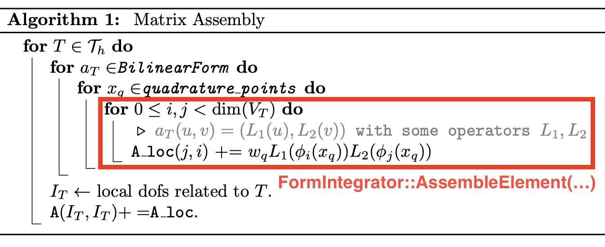

<style>
  :root {
  }
  h1 {
    font-size: 26pt;
  }
  h2 {
    font-size: 22pt;
  }
  li {
    font-size: 18pt;
  }
  p {
    font-size: 18pt;
  }
  img[alt~="center"] {
    display: block;
    margin: 0 auto;
  }
  pre {
   background-color: #eee;
  }
</style>

<!-- _paginate: false -->


# **MFEM Tutorial**

#### Dohyun Kim

##### Appl. Math., Brown Univ.

_APMA 2560_
_Feb 28, 2024_

---

<!-- _paginate: false -->

# Table of Contents

* Weak Formulation
* Finite Element Formulation
* Basic Structures for Linear Problem: $a_h(u,v) = b_h(v)$
* Technical Details
  - Mesh, Basis, Assembly, Quadrature rules,

---

# Weak Formulation

Consider the Poisson equation with homogeneous Dirichlet BC

$$
\begin{align*}
-Δ u&=f&&\text{in }\Omega,\\
u&=0&&\text{on }\partial\Omega.
\end{align*}
$$

The corresponding weak formulation is: Find $u∈H^1_0(\Omega)$ such that

$$
\begin{equation}
a(u,v):= (∇ u, ∇ v) = (f,v) =: b(v)\quad∀v∈H^1_0(\Omega).
\end{equation}
$$

---

# Discrete Space

Let $\mathcal{T}_h$ be a given mesh, and
$$V_h=\{v∈C^0(\Omega):v|_T∈ \mathbb{P}_p(T)\;∀ T∈ \mathcal{T}_h\}.$$

We impose the boundary condition by setting

$$
V_h^g=\{v∈ V_h:v|_e=\Pi_h^eg\;∀e\in\mathcal{E}_h\}
$$

where $\Pi_h^e$ is a projection onto $\mathbb{P}_p(e)$ and globally continuous if necessary.


---

# Discrete Formulation

The corresponding discrete problem is: Find $u_h∈ V_h^g$ such that

$$
a_h(u_h,v):=\sum_{T\in\mathcal{T}_h}(∇ u_h,∇ v)_T=\sum_{T\in\mathcal{T}_h}(f,v)_T=:b_h(v)\quad ∀ v∈ V_h^0.
$$

Here, $a_h(\cdot,\cdot)$ is a bilinear form, and $b_h(\cdot)$ is a linear form so that

* $a_h(u+w,cv)=ca_h(u,v)+ca_h(w,v)$ for all $u,w,v∈ V_h$ and $c\in\mathbb{R}$,
* $a_h(cu,v+w)=ca_h(u,v)+ca_h(u,w)$ for all $u,v,w∈ V_h$ and $c\in\mathbb{R}$,
* $b_h(cv+w)= cb_h(v)+b_h(w)$ for all $v,w∈ V_h$ and $c\in\mathbb{R}$.

* Note that $a_h(\cdot,\cdot)=a(\cdot,\cdot),\;b_h(\cdot)=b(\cdot)$ for the most of conforming FEMs.
* But, $a_h(\cdot,\cdot)≠a(\cdot,\cdot)$ when you consider, e.g., Discontinuous Galerkin method.

---

# Basis of $V_h$


* Let $\{\phi_i\}_{i=1}^N$ be a basis of $V_h$. Then for given $v∈ V_h$, there exists $(c_1,\cdots,c_N)$ such that
   $$
   v=\sum_{j=1}^Nc_j\phi_i
   $$

* Then we can rewrite the equation as: Find $u_h=\sum_{j=1}^Nc_j\phi_j$ or find $\{c_j\}_{j=1}^N$ such that
   $$
   a_h(\sum_{j=1}^Nc_j\phi_j,v)=\sum_{j=1}^N c_j a_h(\phi_j, v)=b_h(v)\quad∀ v∈ V_h.
   $$

* Since $V_h$ is finite dimensional and $a_h(\cdot,\cdot)$ is a bilinear form, it is enough to test the equation against basis functions.
   $$
   \sum_{j=1}^N c_j a_h(\phi_j, \phi_i)=b_h(\phi_i)\quad∀ i∈ 1,\cdots,N.
   $$

---

# Linear System

* Now we obtained a set of equations
  
   $$
   \sum_{j=1}^N c_j a_h(\phi_j, \phi_i)=b_h(\phi_i)\quad∀ i∈ 1,\cdots,N.
   $$

* This can be rewritten as
   $$
   Ax=b
   $$
   where 
   $$
   A_{ij} = a_h(\phi_j, \phi_i), x_i = c_i, b_i = b_h(\phi_i)
   $$


---

# Summary

* For given finite element space $V_h$ with $dim(V_h)=N$, we find solution $u_h ∈ V_h$ by

   $$
   a_h(u_h,v):=\sum_{T∈\mathcal{T}_h}(∇ u_h, \nabla v)_T=\sum_{T\in\mathcal{T}_h}(f,v)_T=:b_h(v)\quad∀ v∈ V_h
   $$

* Using the basis representation, we obtain the corresponding linear system

   $$
   Ax = b
   $$
   where
   $$
   A_{ij} = a_h(\phi_j,\phi_i),\ x_i = c_i,\ b_i = b_h(\phi_i)
   $$

---

<style>
  :root {
  }
  h1 {
    font-size: 32pt;
  }
  h2 {
    font-size: 24pt;
  }
  li {
    font-size: 18pt;
  }
  p {
    font-size: 18pt;
  }
  img[alt~="center"] {
    display: block;
    margin: 0 auto;
  }
</style>

<!-- _paginate: false -->


# **Finite Element Space**

   ## Discrete Space

   ## FiniteElementCollection

   ## Mesh

   ## FiniteElementSpace

   ## GridFunction / Coefficient

---

# Discrete Space

* Recall that a finite space is defined by
    $$
    V_h = \{v\in V:v|_T\in V_T\text{ for all }T\in\mathcal{T}_h\}.
    $$
* We need three components to define $V_h$
    - Local space: $V_T$
      - Polynomial space $P_k(T)$, Raviart-Thomas space $RT_k(T)$, etc.
    - Mesh: $\mathcal{T}_h$
      - Triangular mesh, Quadrilateral mesh, Tetahedral mesh, etc.
    - Global continuity or regularity $V$
      - $L^2(\Omega)$, $C^0(\Omega)$, $C^1(\Omega)$, etc.
* The local space is `FiniteElementCollection`
* The mesh is `(Par)Mesh`
* Global continuity is encoded in `FiniteElementCollection`

---

# FiniteElementCollection

* We use `FiniteElementCollection` to represent a local finite element space.

* Examples are: ($P_k$: Complete polynomial, $Q_k$: Tensor product polynomial)
  * `H1_FECollection` - Continuous $P_k/Q_k$ space
  * `DG_FECollection/L2_FECollection` - Discontinuous $P_k/Q_k$ space
  * `RT_FECollection` - $H(div)$-conforming Raviart-Thomas space
  * `ND_FECollection` - $H(curl)$-conforming Nedelec space
  * see, <a href="https://docs.mfem.org/html/classmfem_1_1FiniteElementCollection.html" target="_blank">FiniteElementCollection</a> for exhaustive list.

* Code Example:
   ```cpp
   FiniteElementCollection *fec = new DG_FECollection(order, dim);
   FiniteElementCollection *fec = new H1_FECollection(order, dim);
   ```

---

# Mesh

* We use `Mesh` class to represent meshes.
* A `Mesh` object can be created either from a file
   ```cpp
   Mesh mesh("path/to/meshfile.mesh");
   ```
* or
   ```cpp
   Mesh mesh = Mesh::MakeCartesian2D(nx, ny, Element::QUADRILATERAL); // Uniform 2D rectangular mesh
   ```
* You can also perform refinements or save the mesh
   ```cpp
   Mesh mesh = Mesh::MakeCartesian2D(nx, ny, Element::TRIANGLE);
   mesh.UniformRefinement();     // Uniform refine
   mesh.RefineByError(err, tol); // Refine where err > tol
   mesh.Save("path/to/meshfile.mesh");
   ```
* It supports nonconforming and/or curved meshes.
* The mesh file can be created 1) manually, 2) Gmsh, and so on. See, this <a href="https://mfem.org/mesh-formats/" target="_blank">guide</a>.

---

# Finite Element Space

* With `FiniteElementCollection` and `Mesh`, we can define a finite element space $V_h$.
* We use a `FiniteElementSpace` class to store the information
* For example, $P^1-C^0$ finite element space associated with a uniform rectangular mesh
   ```cpp
   const int dim = 2;
   const int order = 1;
   const int nx = ny = 10;
   FiniteElementCollection *fec = new H1_FECollection(order, dim);
   Mesh mesh = Mesh::MakeCartesian2D(nx, ny, Element::QUADRILATERAL);
   FiniteElementSpace fes(&mesh, fec); // P1-C0 Finite element space
   ```
* A vector finite element space can be constructed either
    - with vector `FiniteElementCollection`, e.g., `RT_FECollection`
    - with tensor product space with a scalar `FiniteElementCollection`
    ```cpp
    const int vdim = 2;
    FiniteElementSpace vfes(&mesh, fec, vdim); // P1-C0 vector FE space
    ```
---

# GridFunction

* A discrete function $u_h\in V_h$ can be created using
   ```cpp
   GridFunction u(&fes);
   ```
* For a discrete function $u_h\in V_h$, there exists a unique $\{c_i\}_{i=1}^N\subset \mathbb{R}$ such that
    $$
    u_h(x) = \sum_{i=1}^Nc_i\phi_i(x)\text{ where }V_h=\text{span}(\{\phi_i\}_{i=1}^N).
    $$
* A `GridFunction` stores the primal vector, `[c_1, c_2, ..., c_N]` associated with $u_h$ and $V_h$ (`fes`).
* If we use nodal basis functions $\phi_i(x_j)=\delta_{ij}$, then $c_i = u_h(x_i)$ for each node $x_i$.

---

<!-- # FunctionCoefficient

* On the other hand, `FunctionCoefficient` represents a function $\mathbb{R}^n\rightarrow\mathbb{R}$.
   ```cpp
   // 2D coordinates x=(x,y) ↦ sin(x)*sin(y)
   FunctionCoefficient f([](const Vector& x){return sin(x[0])*sin(x[1])});
   ```
* For a vector-valued function, we use `VectorFunctionCoefficient`
   ```cpp
   // 2D coordinates x=(x,y) ↦ (sin(x), sin(y))
   VectorFunctionCoefficient f(2, [](const Vector &x, Vector y){y[0] = sin(x[0]); y[1] = sin(x[1])});
   ```
* When you want to compute its value at `x`, then use
   ```cpp
   Vector x(2);
   x = 0.5; // equivalent to x[0] = x[1] = 0.5;
   const double value = f.Eval(x); // if f:R^n → R
   Vector y(2);
   f.Eval(x, y); // if f:R^n → R^d
   ```

--- -->

# Summary

```cpp
const int order = 2; // order of polynomial
const int nx = ny = 4; // number of elements in each axis

FiniteElementCollection *fec = new H1_FECollection(order, dim); // C0, Quadratic Polynomial
Mesh mesh = Mesh::MakeCartesian2D(nx, ny, Element::QUADRILATERAL); // Uniform quadrilateral mesh
const int dim  = mesh.Dimension(); // spatial dimension, 2
// You can also define a vector FE space
const int vdim = 2; // vector dimension
FiniteElementSpace fespace(&mesh, fec, vdim); // [C0-Q2 space]^2
GridFunction u(&fespace);
```


---

<style>
  :root {
  }
  h1 {
    font-size: 32pt;
  }
  h2 {
    font-size: 24pt;
  }
  li {
    font-size: 18pt;
  }
  p {
    font-size: 18pt;
  }
  img[alt~="center"] {
    display: block;
    margin: 0 auto;
  }
</style>

<!-- _paginate: false -->


# **BilinearForm and LinearForm**

   ## BilinearForm

   ## LinearForm

   ## NonlinearForm

---


---


---

# BilinearForm

* We want to express our bilinear form $a_h(u,v)=\sum_{T\in T_h}a_T(u,v)$.
* This operator is $a_h(\cdot,\cdot):V_h × V_h \rightarrow \mathbb{R}$.
* We use `BilinearForm` to represent such operator
   ```cpp
   BilinearForm a_h(&fespace);
   ```
* If $a_h(\cdot,\cdot):V_h× W_h→ \mathbb{R}$, then
  ```cpp
  MixedBilinearForm a_h(&fespace1, &fespace2);
  ```
* We can add local bilinear forms to populate our bilinear form `a_h`.
  ```cpp
  a_h.AddDomainIntegrator(new DiffusionIntegrator()); // a_h += (∇u, ∇v)
  a_h.AddDomainIntegrator(new MassIntegrator());      // a_h += (u, v)
  ```
* `DiffusionIntegrator` and `MassIntegrator` are `BilinearFormIntegrator`
* This corresponds to a local bilinear form $a_T(u,v)$. See, <a href="https://mfem.org/bilininteg/" target="_blank">`fem/bilininteg.hpp`</a>

---

# LinearForm

* Similarly, we have a linear form $b_h(v)=\sum_{T\in T_h}b_T(v)$.
* This operator is $b_h(\cdot):V_h \rightarrow \mathbb{R}$.
* We use `LinearForm` to represent such operator
   ```cpp
   LinearForm b_h(&fespace);
   ```
* We can add local linear forms to populate our linear form `b_h`.
  ```cpp
  b_h.AddDomainIntegrator(new DomainLFIntegrator(f)); // b_h += (f,v)
  b_h.AddBoundaryIntegrator(new BoundaryLFIntegrator(g_N));// b_h += (g_N, v)_e
  ```
* `DomainLFIntegrator` and `BoundaryLFIntegrator` are `LinearFormIntegrator`
* This corresponds to a local linear form $b_T(v)$. See, <a href="https://mfem.org/lininteg/" target="_blank">`fem/lininteg.hpp`</a>

---

# Assembly

* With basis $\{\phi_i\}$ of $V_h$, $a_h(\cdot,\cdot)$ can be realized
    $$
    a_h(\phi_i,\phi_j)=\sum_{T\in\mathcal{T}_h}a_T(\phi_i,\phi_j).
    $$
* For given $T$, we define
  $$
  J_T=\{j\in\mathbb{N}:\phi_j|_T\neq0\}
  $$
* If basis is local, $|J_T|\ll dim(V_h)$. Also, we have
  $$
  a_T(\phi_i,\phi_j)=\begin{cases}c&\text{if }i,j\in J_T,\\0&\text{otherwise}.\end{cases}
  $$
  Similar condition holds for $b_T(\phi_j)$.
* This implies sparsity of $A$, and provides an assembly procedure.

---

# Assembly


* `R_T`, `P_T`: Mapping between the global and local
  * `R_T*A = A(J_T, J_T) = A_loc`
* `B`, `Q`: Mapping between basis and values at points.
  * `B` can be function value, derivative value, etc.
* `D`: Operation on quadrature values (dot products, weight, ...)
  * `D(U, Ux, Uy, V, Vx, Vy) = Ux*Vx + Uy*Vy`


---

# Assembly - Pseudocode


---

# Assembly - Pseudocode



---

<!-- # FormIntegrator

* Now you have a bilinear form $a_h(\cdot,\cdot)$, `BilinearForm a`
* But you did not specify its actual implementation
  $$
  a_h(u, v) = \sum_{T\in\mathcal{T}_h}(∇ u, ∇ v)_T
  $$
* The local bilinear form $(∇ u, ∇ v)_T$ is called `BilinearFormIntegrator`.
* This class should contains:
  * `AssembleElementMatrix`: if it is an element integrator, $(\cdot,\cdot)_T$
  * `AssembleFaceMatrix`: if it is a face integrator, $(\cdot,\cdot)_F$
  * ... see, <a href="https://docs.mfem.org/html/bilininteg_8hpp_source.html" target="_blank">`fem/bilininteg.hpp`</a>
* Examples are:
  * `MassIntegrator`: $(u, v)_T$
  * `DiffusionIntegrator`: $(∇ u, ∇ v)_T$
  * `MixedVectorDivergenceIntegrator`: $(∇ ⋅ u, v)_T$
  * `TransposeIntegrator`: convert $(f(u), g(v))$ to $(f(v), g(u))$

---
# FormIntegrator - continued

* You can add `BilinearFormIntegrator` to `BilinearForm`
   ```cpp
   BilinearForm a_h(&fespace);
   a_h.AddDomainIntegrator(new DiffusionIntegrator); // a_h = ∑_T(∇ u, ∇ v)_T
   a_h.AddDomainIntegrator(new MassIntegrator); // a_h = ∑_T [ (∇ u, ∇ v)_T + (u, v)_T ]
   a_h.AddInteriorFaceIntegrator(new SomeFaceIntegrator); // a_h = ... + ∑_{F_i}(⋅⋅⋅, ⋅⋅⋅)_F
   a_h.AddBoundaryIntegrator(new SomeFaceIntegrator); // a_h = ... + ∑_{F_b}(⋅⋅⋅, ⋅⋅⋅)_F
   ```
* For a `LinearForm`, you can use `LinearFormIntegrator`
* The most useful one is `DomainLFIntegrator` and `BoundaryLFIntegrator`
   ```cpp
   LinearForm b_h(&fespace);
   b_h.AddDomainIntegrator(new DomainLFIntegrator(f)); // b_h = ∑_T (f, v)
   b_h.AddBoundaryIntegrator(new BoundaryLFIntegrator(g, nbc_bdr)); // b_h = ... + ∑_{F_{b,N}}(g_N, v)_F
   ```

--- -->
# How to write FormIntegrator

```cpp
void MassIntegrator::AssembleElementMatrix(
    const FiniteElement &el, ElementTransformation &Trans, DenseMatrix &elmat)
{
   // INPUT el: Local finite element: basis, dof, ...
   // INPUT Trans: Local mesh information. e.g., element location, Jacobian
   // OUTPUT elmat: resulting (ϕ_j, ϕ_i) where 0 ≤ i,j ≤ nd is local dof
   int nd = el.GetDof(); // the number of basis related to current element
   double w; // store weight

   Vector shape; // store basis function values at an integration point
   shape.SetSize(nd);
   elmat.SetSize(nd); // set output size

   // Determine integration rule in the location
   const IntegrationRule *ir = IntRule ? IntRule : &GetRule(el, el, Trans);

   elmat = 0.0; // initialize with 0
   for (int i = 0; i < ir->GetNPoints(); i++) // for each integration point
   {
      // Get current integration point (x_i, w_i)
      const IntegrationPoint &ip = ir->IntPoint(i);
      Trans.SetIntPoint (&ip);
      // 
      el.CalcPhysShape(Trans, shape);
      // update weight based on the element jacobian and integration weight
      w = Trans.Weight() * ip.weight;
      // elmat = elmat + w * (shape * shape^T)
      // Why? DIY
      AddMult_a_VVt(w, shape, elmat);
   }
} // Also see, DiffusionIntegrator, MixedVectorDivergenceOperator, ...
```

---

# Assembly Level

```cpp
a_h.SetAssemblyLevel(AssemblyLevel::<LEVEL>)
```
* `FULL` (or `LEGACY`)
  * Construct global sparse matrix
* `ELEMENT`
  * Assemble only local matrices `A_loc`. `Ax` can be computed element-wisely,
    $$
        \texttt{A*x}=\sum_T P_T*(\texttt{A\_loc}*\texttt{x\_loc})
    $$
* `PARTIAL`
  * Assemble only on a "reference" element, and other computations are done on-the-fly. See, <a href="http://www.lcad.icmc.usp.br/~buscaglia/teaching/fem/2015/slides20150429.pdf" target="_blank">here</a>
* `NONE`
  * Store nothing, everything is on-the-fly.
---

# Coefficient

* Recall that we used `f` when we define local linear form
  ```cpp
  LinearForm b_h(&fespace);
  b_h.AddDomainIntegrator(new DomainLFIntegrator(f)); // b_h += (f,v)
  ```
* Here, `f` is a `Coefficient`. More specifically, `FunctionCoefficient`.
* `Coefficient` represents a function
  ```cpp
  ConstantCoefficient one_cf(1.0);
  FunctionCoefficient f([](Vector &x){return sin(pi*x[0])*sin(pi*x[1]);});
  FunctionCoefficient g([](Vector &x, double t){return exp(-t)*sin(pi*x[0]);});
  GridFunctionCoefficient u_cf(&u_h); // Use GridFunction as a function
  u_h.ProjectCoefficient(f); // interpolate given function f
  b_h.AddDomainIntegrator(new DomainLFIntegrator(f)); // b_h += (f,v)
  ```

---

<style>
  :root {
  }
  h1 {
    font-size: 32pt;
  }
  h2 {
    font-size: 24pt;
  }
  li {
    font-size: 18pt;
  }
  p {
    font-size: 18pt;
  }
  img[alt~="center"] {
    display: block;
    margin: 0 auto;
  }
</style>

<!-- _paginate: false -->


# **Ax=b and Solve**

   ## Essential Boundary

   ## FormLinearSystem

   ## Solvers

   ## RecoverFEMSolution

   ## Visualization

---

# $a_h(u,v)=b_h(v)$ and $Ax=b$

* Now we described our discrete problem $a_h(u, v) = b_h(v)$ in `MFEM`.
* Note that the essential BC has not been addressed yet.
* Recall that for $C^0$-finite element space,
   we impose Dirichlet boundary condition by
   $V_h^g=\{v∈ V_h:v|_{\Gamma_D}=g_D\}$
* Degrees of freedom related to $\Gamma_D$ are NOT unknowns.
* Therefore, we need to remove those degrees of freedom from the final linear system.

---

# Essential Boundary

* In a mesh file, you can specify boundary attribute
   ```
   # Mesh faces/edges on the boundary, e.g. triangles (2)
   boundary
   8 # 8 boundaries
   1 1 0 1 # Bottom (1), Segment, vertex 0 - vertex 1
   1 1 1 2 # Borrom (1), Segment, vertex 1 - vertex 2
   2 1 2 4 # Right (2), Segment, vertex 2 - vertex 4
   2 1 4 8 # Right (2), Segment, vertex 4 - vertex 8
   ...
   ```
* Suppose that you want to specify Dirichlet BC at bottom.
   ```cpp
   Mesh mesh(mesh_file);
   // create an integer array of size, the number of boundary attributes
   Array<int> ess_bdr(mesh.bdr_attributes.Max()); // in this case, 4
   ess_bdr = 0; // initialize with 0
   ess_bdr[0] = 1; // first boundary, bottom, is essential boundary
   // stores all degrees of freedom on the Dirichlet Boundary
   Array<int> ess_tdof_list;
   fespace.GetEssentialTrueDofs(ess_bdr, ess_tdof_list); // Obtain related dofs
   ```
---

# FormLinearSystem

* To obtain the linear system from `BilinearForm a_h` and `LinarForm b_h`, we can
   ```cpp
   OperatorPtr A;
   Vector B, X;
   a_h.FormLinearSystem(ess_tdof_list, u, b_h, A, X, B);
   ```
* Here,
  * `u`: `GridFunction`, the solution with specified value on essential boundary
  * `A`: `OperatorPtr` or `SparseMatrix`, the resulting matrix $A$
  * `B`: `Vector`, the resulting load vector $b$ (also called dual vector)
  * `X`: `Vector`, the vector containing coefficient, $x$ (also called primal vector)

---
# Solve Linear System

* To solve a system, there are many solvers in `MFEM`.
* Direct Sparse Solvers: `UMFPackSolver`: General matrix from `SuiteSparse`
* Iterative Solvers:
  * `CG`: (Preconditioned) Conjugate gradient method for SPD system
    ```cpp
    CGSolver cg();
    cg.SetOperator(*A);
    cg.Mult(B, X);
    ```
  * `GMRES`: (Preconditioned) generalized minimal residual method for general system
    ```cpp
    GMRESSolver gmres();
    gmres.SetOperator(*A);
    gmres.Mult(B, X);
    ```

---
# Recover Solution

* Now, your solution is saved in `Vector X`.
* You can convert it back to a `GridFunction` by using
   ```cpp
   a_h.RecoverFEMSolution(X, b, u);
   ```
* Then you can save and visualize using
   ```cpp
   u.Save(solution.gf);
   sout << "solution\n" << mesh << u; // plot solution
   sout << "view 0 0\n"; // top view
   sout << flush; // draw
   ```
* For more about visualization, see `ex1.cpp` and `glvis`.
* Note that you need to run `glvis` in the background!
* For 3D visualization or high-quality results, use `ParaView`.

---

# Parallel Implementation

* `make parallel` - Requires additional dependencies, see <a href="https://mfem.org/building/" target="_blank">instruction</a>.
* Usually, you can just put `Par` before types. See, <a href="https://github.com/mfem/mfem/blob/master/examples/ex0p.cpp" target="_blank">ex0p.cpp</a>.
  ```cpp
  Mpi::Init(); // Initialize MPI
  H1_FECollection fec(order, dim);
  ParMesh mesh(mesh_file); // Elements are distributed in each process

  ParFiniteElementSpace fes(&mesh, &fec);
  ParBilinearForm a_h(&fes);
  ParLinearForm b_h(&fes);
  ParGridFunction u_h(&fes);

  a_h.AddDomainIntegrator(new DiffusionIntegrator());
  ConstantCoefficient one_cf(1.0);
  b_h.AddDomainIntegrator(new DomainLFIntegrator(one_cf));
  ...
  ```
* Run with `mpirun -np <num_process> <file>`

---

<style>
  :root {
  }
  h1 {
    font-size: 32pt;
  }
  h2 {
    font-size: 24pt;
  }
  li {
    font-size: 18pt;
  }
  p {
    font-size: 18pt;
  }
  img[alt~="center"] {
    display: block;
    margin: 0 auto;
  }
</style>

<!-- _paginate: false -->


# **Questions**


https://dohyun-cse.github.io/mfem-tutorial

---

# Appendix

- Mac OS need a patch and `patchelf`
  ```bash
  brew install patchelf
  git clone git@github.com:mfem/pymfem.git
  git checkout rpath-patch
  cd pymfem
  python setup.py install ...
  ```
- `PyMFEM` needs `swig`
  ```bash
  brew install swig
  python -m pip install swig
  python -m pip install mfem
  python setup.py install
  ```
- `PyMFEM` with parallel
  ```bash
  brew install open-mpi
  python -m pip install mpi4py
  python setup.py install --with-parallel
  ```